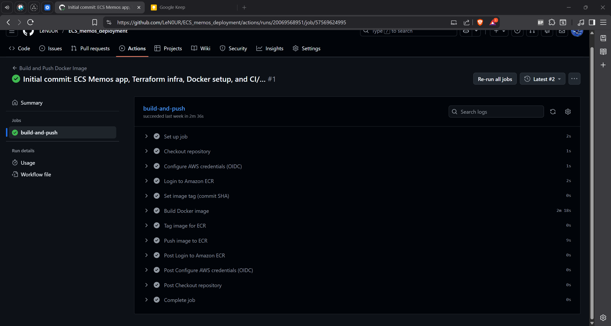
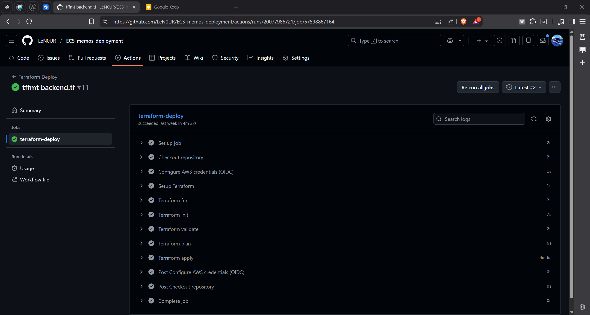
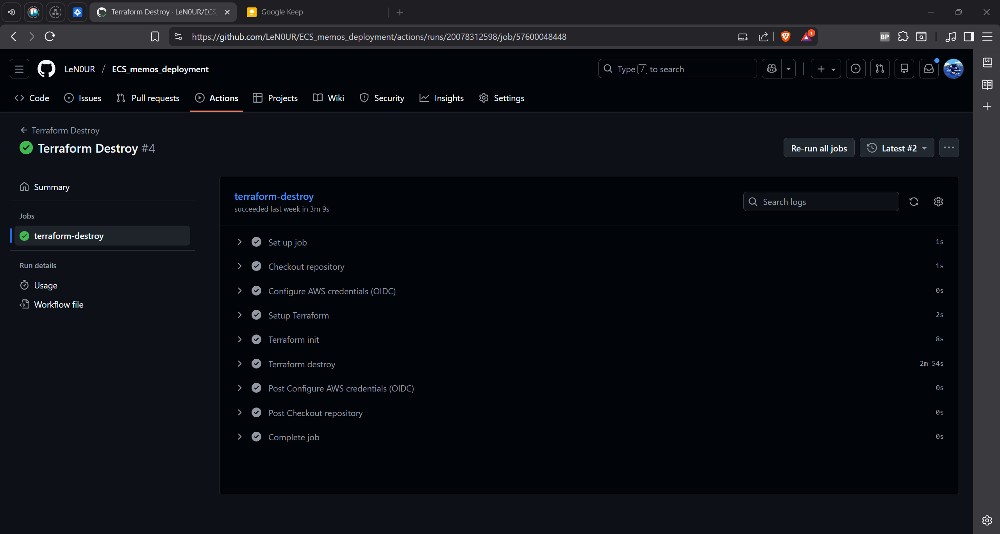

#  Memos Application: An End-to-End AWS ECS Deployment Using Terraform, Docker & GitHub Actions

## Overview

This project demonstrates a **production-grade containerised application deployment on AWS** using modern DevOps best practices.  
It showcases Infrastructure as Code, secure CI/CD pipelines, and ECS Fargate orchestration using a real-world open-source application.

The application is **built from source**, containerised with Docker, and deployed to **AWS ECS Fargate** behind an HTTPS-enabled Application Load Balancer.  
All infrastructure is provisioned and managed using **Terraform**, with deployments automated via **GitHub Actions (OIDC-based authentication)**.


## Application Overview

**Memos** is a lightweight, self-hosted note-taking application written in Go.  
It is used here as a representative production workload to demonstrate containerisation, orchestration, and infrastructure automation.

Key characteristics:
- Web-based UI
- SQLite-backed persistence
- Runs on port `5230`
- Built from source during Docker image creation


## Demo

### Live Deployment (Screenshots)

  


## Architecture

### Architecture Diagram


### Architecture Components

- **Route 53**  
  Public DNS for the application domain, routing user traffic to the load balancer.

- **Application Load Balancer (ALB)**  
  Terminates HTTPS using ACM certificates and forwards traffic to ECS tasks.

- **ECS Fargate Service**  
  Runs the containerised Memos application as stateless tasks across multiple AZs.

- **Amazon ECR**  
  Stores versioned Docker images built and pushed by the CI pipeline.

- **GitHub Actions**  
  Automates CI/CD workflows and authenticates to AWS using OIDC.

- **Terraform**  
  Provisions and manages all AWS infrastructure using modular IaC with remote state.

- **CloudWatch Logs**  
  Centralised logging for ECS task output and application diagnostics.

### Infrastructure Overview

The application runs as a **stateless ECS Fargate service** behind an **Application Load Balancer**.  
Traffic is routed via **Route 53** and secured using **ACM-managed TLS certificates**.  
Container images are stored in **Amazon ECR**, and application logs are streamed to **CloudWatch Logs**.

Infrastructure is provisioned using **modular Terraform**, with remote state stored in **S3** and state locking via **DynamoDB**.

### Data Flow

- **User Traffic:** Users → Route 53 → ALB → ECS Fargate (port 5230)
- **CI/CD:** GitHub Actions → Docker Build → ECR → ECS Service Update
- **Infrastructure:** Terraform → AWS (VPC, ALB, ECS, ECR, ACM)
- **Logging:** ECS Tasks → CloudWatch Logs (`/ecs/memos`)


## Tech Stack

### Application
- Language: Go
- Application: Memos (open-source)
- Containerisation: Docker (multi-stage build)

### Infrastructure
- AWS ECS Fargate
- Application Load Balancer
- VPC & Public Subnets
- Amazon ECR
- Route 53
- AWS Certificate Manager (ACM)
- CloudWatch Logs

### IaC & Automation
- Terraform (modular, remote state)
- GitHub Actions (CI/CD)
- GitHub → AWS authentication via OIDC


## Project Structure

```text
├── .github/
│   └── workflows/
│       ├── ci-docker.yml
│       ├── deploy.yml
│       └── destroy.yml 
│
├── assets/screenshots
│ 
├── docker/
│   ├── Dockerfile
│   └── .dockerignore
│
├── terraform/
│   ├── main.tf
│   ├── variables.tf
│   ├── providers.tf
│   ├── backend.tf
│   ├── terraform.tfvars
│   └── modules/
│       ├── alb/
│       ├── ecs/
│       ├── route53/
│       ├── security_groups/
│       └── vpc/
│
├── .gitignore
└── README.md
```

## CI/CD Pipelines

CI/CD is implemented using **GitHub Actions** with **OIDC authentication**, removing the need for long-lived AWS credentials.

### Workflows

#### 1. CI – Build & Push (`ci-docker.yml`)
- Triggered on push to `main` or manual dispatch
- Builds Docker image from source
- Tags image with the Git commit SHA
- Pushes image to Amazon ECR

#### 2. Deploy – Infrastructure & App (`deploy.yml`)
- Runs `terraform fmt -check`, `terraform init`, and `terraform validate`
- Generates and applies a Terraform execution plan
- Updates AWS infrastructure (including ECS task definitions) via Terraform
- Performs a post-deployment health check against `/healthz`

#### 3. Destroy – Infrastructure Teardown (`destroy.yml`)
- Manual workflow dispatch
- Destroys all AWS resources via Terraform


### Pipeline Evidence

---

### Build & Push to Amazon ECR


### Terraform Deploy


### Terraform Destroy



## Deployment Workflow

1. Code is pushed to the `main` branch
2. CI workflow builds and pushes the Docker image to ECR
3. Terraform deploy workflow validates and applies infrastructure
4. ECS service updates to the new task definition
5. ALB health checks confirm application availability


## Docker Implementation

### Multi-Stage Build Strategy

**Builder Stage**
- Builds the application fully from source (frontend and backend)
- Uses a Go build environment to compile the Memos binary

**Runtime Stage**
- Minimal Alpine-based runtime image
- Runs as a non-root user
- Includes only the compiled application binary

### Best Practices
- Multi-stage Docker build to separate build and runtime concerns
- Static Go binary compiled for a minimal runtime footprint
- Non-root container execution for improved security
- Reduced attack surface by excluding build tools and dependencies from the final image


## Setup & Reproduction

This project can be reproduced locally for container testing, or fully deployed to AWS using Terraform and GitHub Actions.

### Prerequisites
- AWS account
- Domain name managed in Route 53
- Docker
- Terraform
- GitHub repository fork

### Local Container Build (Optional)

Build and run the application locally using Docker:

```bash
docker build -f docker/dockerfile -t memos-local .
docker run -p 5230:5230 memos-local
Visit: http://localhost:5230
```
### AWS Infrastructure Deployment

The production environment is deployed automatically via GitHub Actions using OIDC authentication.

Technical steps:
1. Configure AWS IAM trust for GitHub Actions (OIDC)
2. Update Terraform variables (region, domain, account ID)
3. Initialise Terraform remote backend (S3 with DynamoDB locking)
4. Trigger the deploy workflow from GitHub Actions

Infrastructure provisioning, container builds, and ECS service updates are fully automated via CI/CD pipelines.


## Security

- No hardcoded AWS credentials
- GitHub Actions authenticated via OIDC
- IAM roles follow least-privilege principles
- ECS tasks run as non-root users
- Minimal attack surface through optimised runtime container images
- HTTPS enforced via ACM-managed TLS certificates
- Security groups restrict traffic appropriately between ALB and ECS


## Monitoring & Logging

- Application logs streamed to Amazon CloudWatch Logs
- ECS service health monitored via ALB health checks
- Failed deployments detected via CI/CD pipeline checks


## Author

**Abdirahman Nour**  
DevOps Engineer | AWS | Terraform | Docker | Kubernetes | CI/CD Automation

- [GitHub](https://github.com/LeN0UR)
- [LinkedIn](https://www.linkedin.com/in/ab-nour/)  


